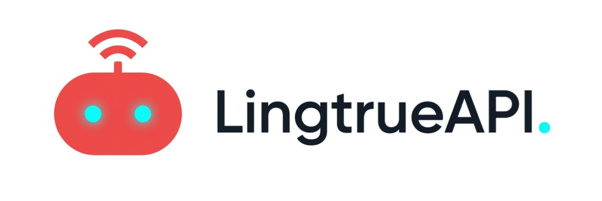

# CLI Proxy API

[English](README.md) | [中文](README_CN.md) | 日本語

CLI向けのOpenAI/Gemini/Claude/Codex互換APIインターフェースを提供するプロキシサーバーです。

OAuth経由でOpenAI Codex（GPTモデル）およびClaude Codeもサポートしています。

ローカルまたはマルチアカウントのCLIアクセスを、OpenAI（Responses含む）/Gemini/Claude互換のクライアントやSDKで利用できます。

## スポンサー

本プロジェクトはZ.aiにスポンサーされており、GLM CODING PLANの提供を受けています。

GLM CODING PLANはAIコーディング向けに設計されたサブスクリプションサービスで、月額わずか$10から利用可能です。フラッグシップのGLM-4.7および（GLM-5はProユーザーのみ利用可能）モデルを10以上の人気AIコーディングツール（Claude Code、Cline、Roo Codeなど）で利用でき、開発者にトップクラスの高速かつ安定したコーディング体験を提供します。

GLM CODING PLANを10%割引で取得：https://z.ai/subscribe?ic=8JVLJQFSKB

---

<table>
<tbody>
<tr>
<td width="180"></td>
<td>PackyCodeのスポンサーシップに感謝します！PackyCodeは信頼性が高く効率的なAPIリレーサービスプロバイダーで、Claude Code、Codex、Geminiなどのリレーサービスを提供しています。PackyCodeは当ソフトウェアのユーザーに特別割引を提供しています：<a href="https://www.packyapi.com/register?aff=cliproxyapi">こちらのリンク</a>から登録し、チャージ時にプロモーションコード「cliproxyapi」を入力すると10%割引になります。</td>
</tr>
<tr>
<td width="180"></td>
<td>AICodeMirrorのスポンサーシップに感謝します！AICodeMirrorはClaude Code / Codex / Gemini CLI向けの公式高安定性リレーサービスを提供しており、エンタープライズグレードの同時接続、迅速な請求書発行、24時間365日の専任技術サポートを備えています。Claude Code / Codex / Geminiの公式チャネルが元の価格の38% / 2% / 9%で利用でき、チャージ時にはさらに割引があります！CLIProxyAPIユーザー向けの特別特典：<a href="https://www.aicodemirror.com/register?invitecode=TJNAIF">こちらのリンク</a>から登録すると、初回チャージが20%割引になり、エンタープライズのお客様は最大25%割引を受けられます！</td>
</tr>
<tr>
<td width="180"></td>
<td>本プロジェクトにご支援いただいた BmoPlus に感謝いたします！BmoPlusは、AIサブスクリプションのヘビーユーザー向けに特化した信頼性の高いAIアカウントサービスプロバイダーであり、安定した ChatGPT Plus / ChatGPT Pro (完全保証) / Claude Pro / Super Grok / Gemini Pro の公式代行チャージおよび即納アカウントを提供しています。こちらの<a href="https://shop.bmoplus.com/?utm_source=github">BmoPlus AIアカウント専門店/代行チャージ</a>経由でご登録・ご注文いただいたユーザー様は、GPTを <b>公式サイト価格の約1割（90% OFF）</b> という驚異的な価格でご利用いただけます！</td>
</tr>
<tr>
<td width="180"></td>
<td>LingtrueAPIのスポンサーシップに感謝します！LingtrueAPIはグローバルな大規模モデルAPIリレーサービスプラットフォームで、Claude Code、Codex、GeminiなどのトップモデルAPI呼び出しサービスを提供し、ユーザーが低コストかつ高い安定性で世界中のAI能力に接続できるよう支援しています。LingtrueAPIは本ソフトウェアのユーザーに特別割引を提供しています：<a href="https://www.lingtrue.com/register">こちらのリンク</a>から登録し、初回チャージ時にプロモーションコード「LingtrueAPI」を入力すると10%割引になります。</td>
</tr>
<tr>
<td width="180"></td>
<td>Poixe AIのスポンサーシップに感謝します！Poixe AIは信頼できるAIモデルAPIサービスを提供しており、プラットフォームが提供するLLM APIを使って簡単にAI製品を構築できます。また、サプライヤーとしてプラットフォームに大規模モデルのリソースを提供し、収益を得ることも可能です。CLIProxyAPIの<a href="https://poixe.com/i/m8kvep">専用リンク</a>から登録すると、チャージ時に追加で$5が付与されます。</td>
</tr>
<tr>
<td width="180"></td>
<td>VisionCoderのご支援に感謝します！<a href="https://coder.visioncoder.cn">VisionCoder 開発プラットフォーム</a> は、信頼性が高く効率的なAPIリレーサービスプロバイダーで、Claude Code、Codex、Geminiなどの主要AIモデルを提供し、開発者やチームがより簡単にAI機能を統合して生産性を向上できるよう支援します。さらに、VisionCoderはユーザー向けに <a href="https://coder.visioncoder.cn">Token Plan</a> の期間限定キャンペーン（1か月購入で1か月分プレゼント）も提供しています。</td>
</tr>
</tbody>
</table>

## 概要

- CLIモデル向けのOpenAI/Gemini/Claude互換APIエンドポイント
- OAuthログインによるOpenAI Codexサポート（GPTモデル）
- OAuthログインによるClaude Codeサポート
- プロバイダールーティングによるAmp CLIおよびIDE拡張機能のサポート
- ストリーミングおよび非ストリーミングレスポンス
- 関数呼び出し/ツールのサポート
- マルチモーダル入力サポート（テキストと画像）
- ラウンドロビン負荷分散による複数アカウント対応（Gemini、OpenAI、Claude）
- シンプルなCLI認証フロー（Gemini、OpenAI、Claude）
- Generative Language APIキーのサポート
- AI Studioビルドのマルチアカウント負荷分散
- Gemini CLIのマルチアカウント負荷分散
- Claude Codeのマルチアカウント負荷分散
- OpenAI Codexのマルチアカウント負荷分散
- 設定によるOpenAI互換アップストリームプロバイダー（例：OpenRouter）
- プロキシ埋め込み用の再利用可能なGo SDK（`docs/sdk-usage.md`を参照）

## はじめに

CLIProxyAPIガイド：[https://help.router-for.me/](https://help.router-for.me/)

## 管理API

[MANAGEMENT_API.md](https://help.router-for.me/management/api)を参照

## Amp CLIサポート

CLIProxyAPIは[Amp CLI](https://ampcode.com)およびAmp IDE拡張機能の統合サポートを含んでおり、Google/ChatGPT/ClaudeのOAuthサブスクリプションをAmpのコーディングツールで使用できます：

- Ampの APIパターン用のプロバイダールートエイリアス（`/api/provider/{provider}/v1...`）
- OAuth認証およびアカウント機能用の管理プロキシ
- 自動ルーティングによるスマートモデルフォールバック
- 利用できないモデルを代替モデルにルーティングする**モデルマッピング**（例：`claude-opus-4.5` → `claude-sonnet-4`）
- localhostのみの管理エンドポイントによるセキュリティファーストの設計

特定のバックエンド系統のリクエスト/レスポンス形状が必要な場合は、統合された `/v1/...` エンドポイントよりも provider-specific のパスを優先してください。

- messages 系のバックエンドには `/api/provider/{provider}/v1/messages`
- モデル単位の generate 系エンドポイントには `/api/provider/{provider}/v1beta/models/...`
- chat-completions 系のバックエンドには `/api/provider/{provider}/v1/chat/completions`

これらのパスはプロトコル面の選択には役立ちますが、同じクライアント向けモデル名が複数バックエンドで再利用されている場合、それだけで推論実行系が一意に固定されるわけではありません。実際の推論ルーティングは、引き続きリクエスト内の model/alias 解決に従います。厳密にバックエンドを固定したい場合は、一意な alias や prefix を使うか、クライアント向けモデル名の重複自体を避けてください。

**→ [Amp CLI統合ガイドの完全版](https://help.router-for.me/agent-client/amp-cli.html)**

## SDKドキュメント

- 使い方：[docs/sdk-usage.md](docs/sdk-usage.md)
- 上級（エグゼキューターとトランスレーター）：[docs/sdk-advanced.md](docs/sdk-advanced.md)
- アクセス：[docs/sdk-access.md](docs/sdk-access.md)
- ウォッチャー：[docs/sdk-watcher.md](docs/sdk-watcher.md)
- カスタムプロバイダーの例：`examples/custom-provider`

## コントリビューション

コントリビューションを歓迎します！お気軽にPull Requestを送ってください。

1. リポジトリをフォーク
2. フィーチャーブランチを作成（`git checkout -b feature/amazing-feature`）
3. 変更をコミット（`git commit -m 'Add some amazing feature'`）
4. ブランチにプッシュ（`git push origin feature/amazing-feature`）
5. Pull Requestを作成

## 関連プロジェクト

CLIProxyAPIをベースにした以下のプロジェクトがあります：

### [vibeproxy](https://github.com/automazeio/vibeproxy)

macOSネイティブのメニューバーアプリで、Claude CodeとChatGPTのサブスクリプションをAIコーディングツールで使用可能 - APIキー不要

### [Subtitle Translator](https://github.com/VjayC/SRT-Subtitle-Translator-Validator)

CLIProxyAPI経由でGeminiサブスクリプションを使用してSRT字幕を翻訳するブラウザベースのツール。自動検証/エラー修正機能付き - APIキー不要

### [CCS (Claude Code Switch)](https://github.com/kaitranntt/ccs)

CLIProxyAPI OAuthを使用して複数のClaudeアカウントや代替モデル（Gemini、Codex、Antigravity）を即座に切り替えるCLIラッパー - APIキー不要

### [Quotio](https://github.com/nguyenphutrong/quotio)

Claude、Gemini、OpenAI、Antigravityのサブスクリプションを統合し、リアルタイムのクォータ追跡とスマート自動フェイルオーバーを備えたmacOSネイティブのメニューバーアプリ。Claude Code、OpenCode、Droidなどのコーディングツール向け - APIキー不要

### [CodMate](https://github.com/loocor/CodMate)

CLI AIセッション（Codex、Claude Code、Gemini CLI）を管理するmacOS SwiftUIネイティブアプリ。統合プロバイダー管理、Gitレビュー、プロジェクト整理、グローバル検索、ターミナル統合機能を搭載。CLIProxyAPIと統合し、Codex、Claude、Gemini、AntigravityのOAuth認証を提供。単一のプロキシエンドポイントを通じた組み込みおよびサードパーティプロバイダーの再ルーティングに対応 - OAuthプロバイダーではAPIキー不要

### [ProxyPilot](https://github.com/Finesssee/ProxyPilot)

TUI、システムトレイ、マルチプロバイダーOAuthを備えたWindows向けCLIProxyAPIフォーク - AIコーディングツール用、APIキー不要

### [Claude Proxy VSCode](https://github.com/uzhao/claude-proxy-vscode)

Claude Codeモデルを素早く切り替えるVSCode拡張機能。バックエンドとしてCLIProxyAPIを統合し、バックグラウンドでの自動ライフサイクル管理を搭載

### [ZeroLimit](https://github.com/0xtbug/zero-limit)

CLIProxyAPIを使用してAIコーディングアシスタントのクォータを監視するTauri + React製のWindowsデスクトップアプリ。Gemini、Claude、OpenAI Codex、Antigravityアカウントの使用量をリアルタイムダッシュボード、システムトレイ統合、ワンクリックプロキシコントロールで追跡 - APIキー不要

### [CPA-XXX Panel](https://github.com/ferretgeek/CPA-X)

CLIProxyAPI向けの軽量Web管理パネル。ヘルスチェック、リソース監視、リアルタイムログ、自動更新、リクエスト統計、料金表示機能を搭載。ワンクリックインストールとsystemdサービスに対応

### [CLIProxyAPI Tray](https://github.com/kitephp/CLIProxyAPI_Tray)

PowerShellスクリプトで実装されたWindowsトレイアプリケーション。サードパーティライブラリに依存せず、ショートカットの自動作成、サイレント実行、パスワード管理、チャネル切り替え（Main / Plus）、自動ダウンロードおよび自動更新に対応

### [霖君](https://github.com/wangdabaoqq/LinJun)

霖君はAIプログラミングアシスタントを管理するクロスプラットフォームデスクトップアプリケーションで、macOS、Windows、Linuxシステムに対応。Claude Code、Gemini CLI、OpenAI Codexなどのコーディングツールを統合管理し、ローカルプロキシによるマルチアカウントクォータ追跡とワンクリック設定が可能

### [CLIProxyAPI Dashboard](https://github.com/itsmylife44/cliproxyapi-dashboard)

Next.js、React、PostgreSQLで構築されたCLIProxyAPI用のモダンなWebベース管理ダッシュボード。リアルタイムログストリーミング、構造化された設定編集、APIキー管理、Claude/Gemini/Codex向けOAuthプロバイダー統合、使用量分析、コンテナ管理、コンパニオンプラグインによるOpenCodeとの設定同期機能を搭載 - 手動でのYAML編集は不要

### [All API Hub](https://github.com/qixing-jk/all-api-hub)

New API互換リレーサイトアカウントをワンストップで管理するブラウザ拡張機能。残高と使用量のダッシュボード、自動チェックイン、一般的なアプリへのワンクリックキーエクスポート、ページ内API可用性テスト、チャネル/モデルの同期とリダイレクト機能を搭載。Management APIを通じてCLIProxyAPIと統合し、ワンクリックでプロバイダーのインポートと設定同期が可能

### [Shadow AI](https://github.com/HEUDavid/shadow-ai)

Shadow AIは制限された環境向けに特別に設計されたAIアシスタントツールです。ウィンドウや痕跡のないステルス動作モードを提供し、LAN（ローカルエリアネットワーク）を介したクロスデバイスAI質疑応答のインタラクションと制御を可能にします。本質的には「画面/音声キャプチャ + AI推論 + 低摩擦デリバリー」の自動化コラボレーションレイヤーであり、制御されたデバイスや制限された環境でアプリケーション横断的にAIアシスタントを没入的に使用できるようユーザーを支援します。

### [ProxyPal](https://github.com/buddingnewinsights/proxypal)

CLIProxyAPIをネイティブGUIでラップしたクロスプラットフォームデスクトップアプリ（macOS、Windows、Linux）。Claude、ChatGPT、Gemini、GitHub Copilot、カスタムOpenAI互換エンドポイントに対応し、使用状況分析、リクエスト監視、人気コーディングツールの自動設定機能を搭載 - APIキー不要

### [CLIProxyAPI Quota Inspector](https://github.com/AllenReder/CLIProxyAPI-Quota-Inspector)

CLIProxyAPI向けのすぐに使えるクロスプラットフォームのクォータ確認ツール。アカウントごとの codex 5h/7d クォータ表示、プラン別ソート、ステータス色分け、複数アカウントの集計分析に対応。

> [!NOTE]
> CLIProxyAPIをベースにプロジェクトを開発した場合は、PRを送ってこのリストに追加してください。

## その他の選択肢

以下のプロジェクトはCLIProxyAPIの移植版またはそれに触発されたものです：

### [9Router](https://github.com/decolua/9router)

CLIProxyAPIに触発されたNext.js実装。インストールと使用が簡単で、フォーマット変換（OpenAI/Claude/Gemini/Ollama）、自動フォールバック付きコンボシステム、指数バックオフ付きマルチアカウント管理、Next.js Webダッシュボード、CLIツール（Cursor、Claude Code、Cline、RooCode）のサポートをゼロから構築 - APIキー不要

### [OmniRoute](https://github.com/diegosouzapw/OmniRoute)

コーディングを止めない。無料および低コストのAIモデルへのスマートルーティングと自動フォールバック。

OmniRouteはマルチプロバイダーLLM向けのAIゲートウェイです：スマートルーティング、負荷分散、リトライ、フォールバックを備えたOpenAI互換エンドポイント。ポリシー、レート制限、キャッシュ、可観測性を追加して、信頼性が高くコストを意識した推論を実現します。

> [!NOTE]
> CLIProxyAPIの移植版またはそれに触発されたプロジェクトを開発した場合は、PRを送ってこのリストに追加してください。

## ライセンス

本プロジェクトはMITライセンスの下でライセンスされています - 詳細は[LICENSE](LICENSE)ファイルを参照してください。
